<div align="center">

# 🛡️ CyberShield

### AI-Powered Personal Protection System Against Social Media Scams & Digital Fraud

[](https://opensource.org/licenses/MIT)
[](https://nodejs.org/)
[](https://react.dev/)
[](https://www.typescriptlang.org/)
[](https://www.mongodb.com/)

**Protect yourself from WhatsApp scams, digital arrest frauds, phishing attacks, and social engineering threats with AI-powered real-time detection.**

[🚀 Live Demo](#-demo) • [📖 Documentation](#-quick-start) • [🤝 Contributing](#-contributing)

</div>

---

## 📸 Screenshots

<div align="center">

### 🏠 Landing Page
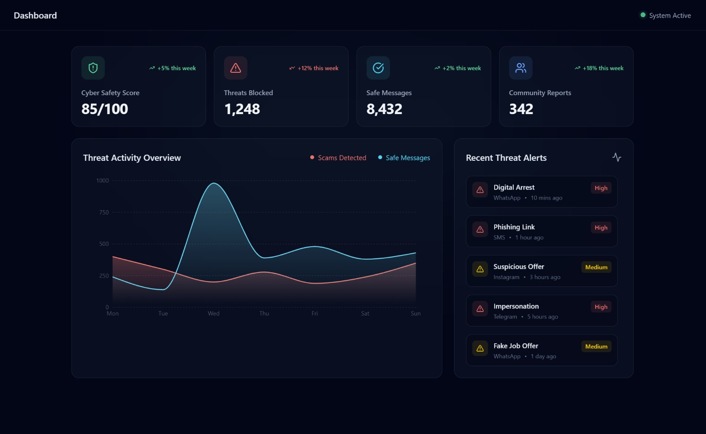

### 🔐 Login
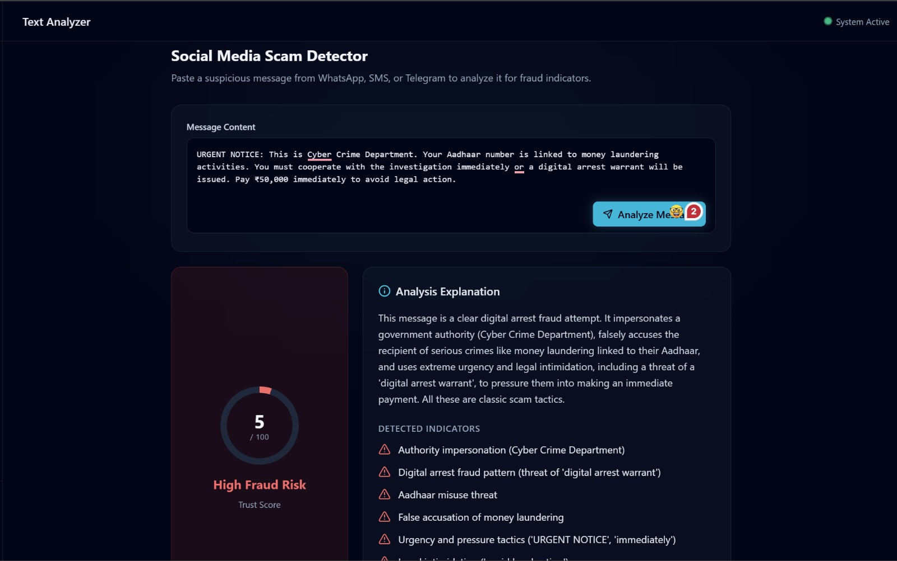

### 📊 Dashboard
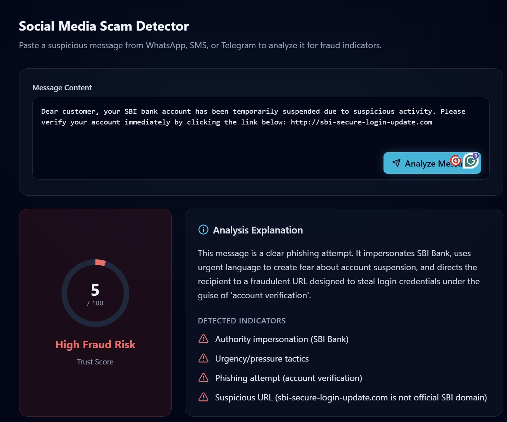

### 🔍 Text Analyzer - Scam Detection
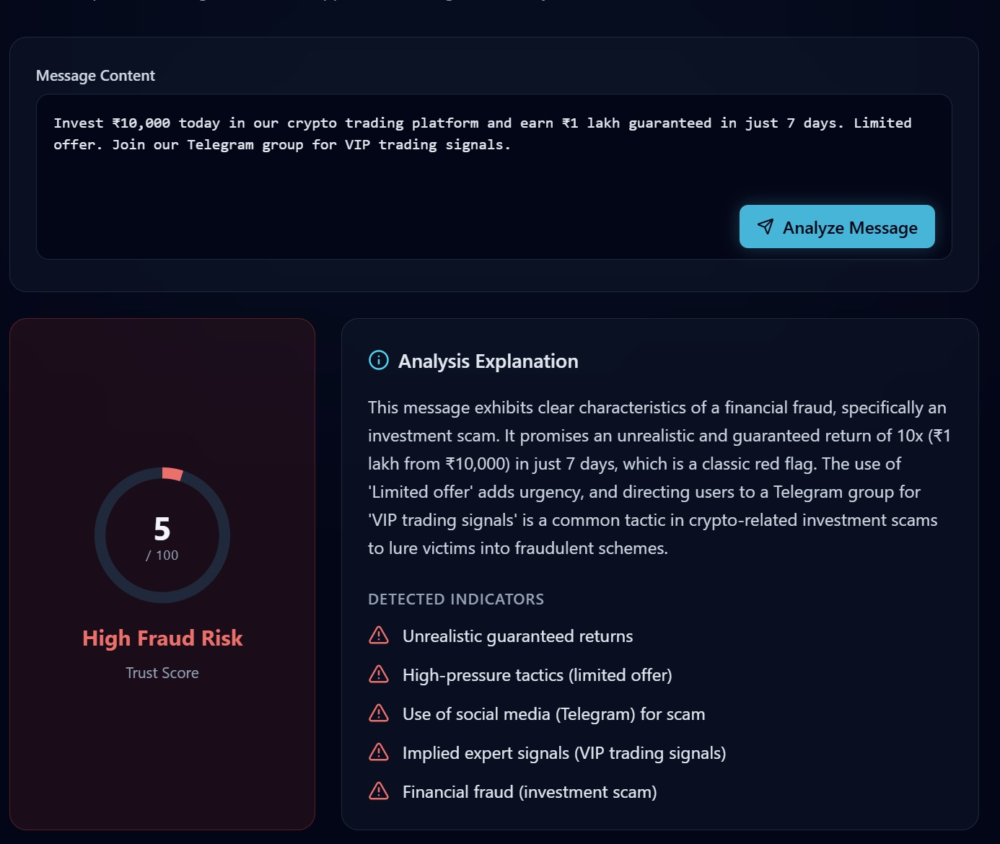

### 🖼️ Image Analyzer - Screenshot Analysis
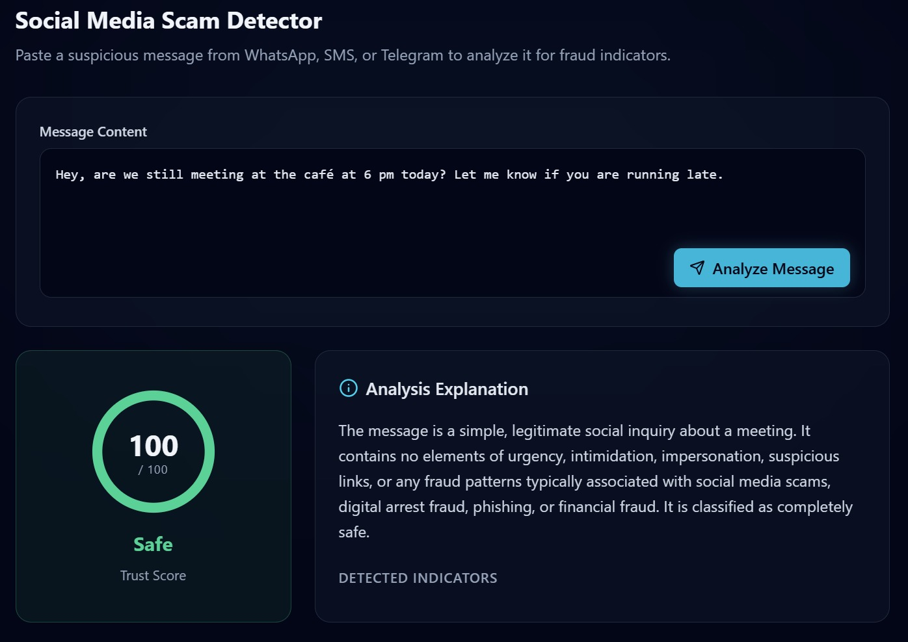

### 🌐 Phishing Scanner
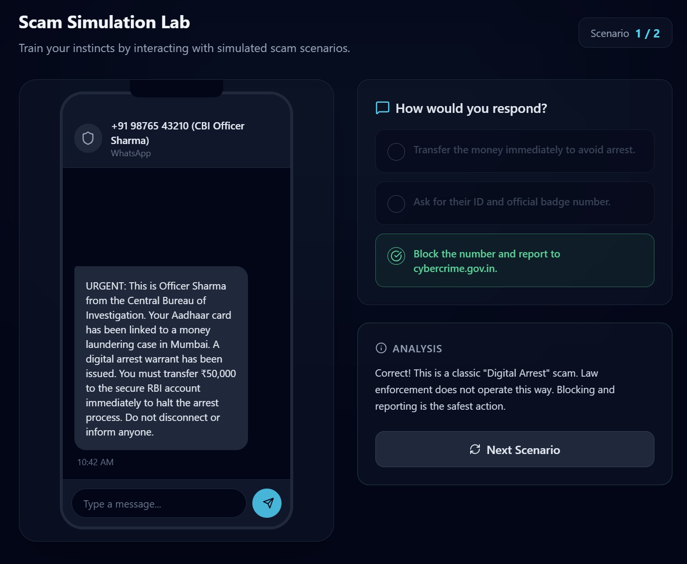

### 📁 File Scanner
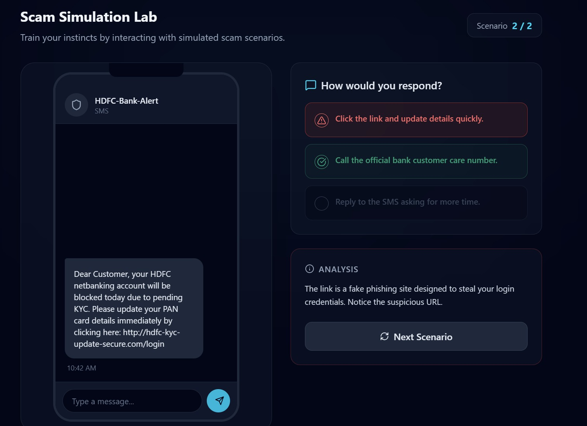

### 🔐 Breach Checker
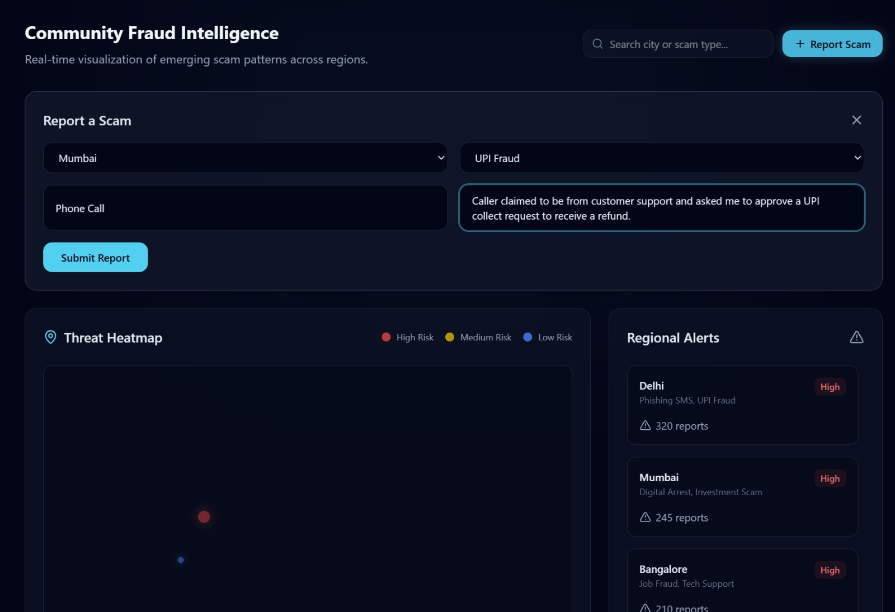

### 🤖 AI Chat Assistant
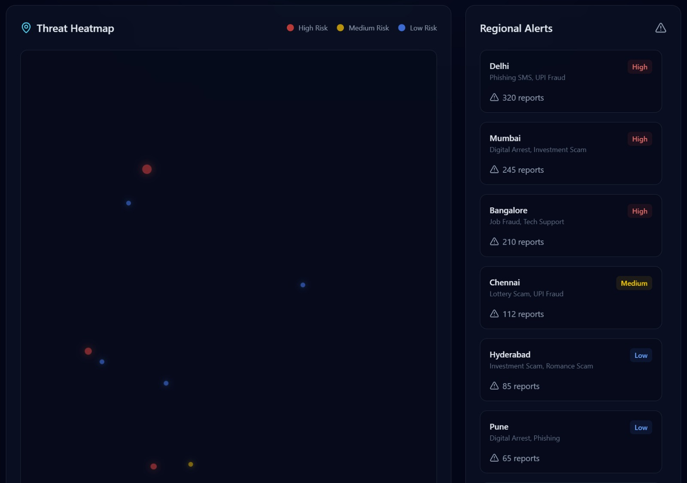

### 🎮 Simulation Lab - Training Mode
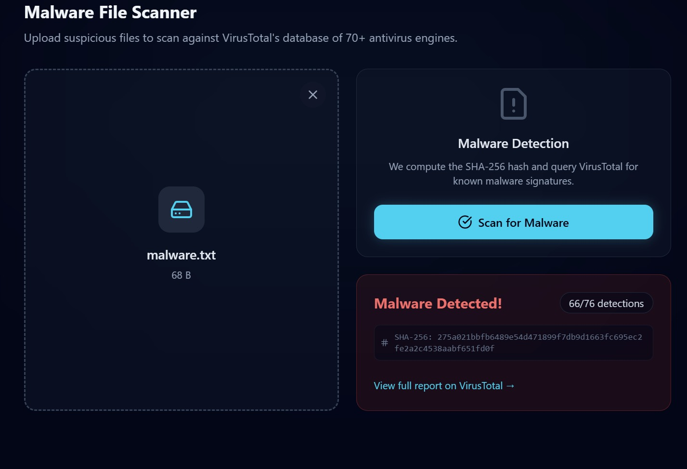

### 🗺️ Fraud Map - India Scam Heatmap
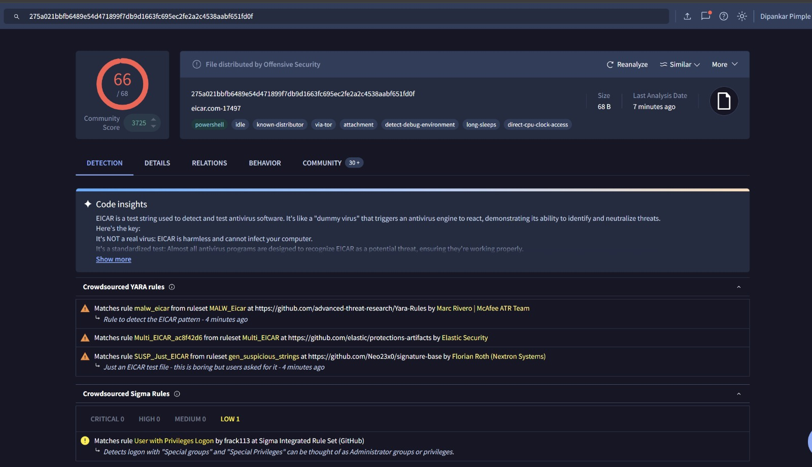

</div>

---

## 🎬 Demo

<div align="center">

[](https://youtube.com/your-demo-video)

*Click above to watch the full demo video*

</div>

---

## ⚡ Key Features

<table>
<tr>
<td width="50%">

### 🔍 Text Analyzer
AI-powered analysis of suspicious messages from WhatsApp, SMS, Telegram. Detects:
- Digital arrest fraud patterns
- Fake bank KYC requests
- Investment/lottery scams
- Authority impersonation

</td>
<td width="50%">

### 🖼️ Image Analyzer
OCR + AI analysis of screenshot fraud attempts:
- Extracts text from images automatically
- Identifies fake notifications & alerts
- Detects manipulated screenshots
- Analyzes suspicious QR codes

</td>
</tr>
<tr>
<td width="50%">

### 🌐 Phishing Scanner
Multi-layered URL verification:
- VirusTotal API integration
- Google Safe Browsing checks
- Domain reputation analysis
- Real-time threat detection

</td>
<td width="50%">

### 📁 File Scanner
Secure file analysis:
- Malware detection via VirusTotal
- Supports multiple file types
- Hash-based threat identification
- Detailed security reports

</td>
</tr>
<tr>
<td width="50%">

### 🔐 Breach Checker
Email security verification:
- HaveIBeenPwned integration
- Data breach history lookup
- Password exposure alerts
- Security recommendations

</td>
<td width="50%">

### 🤖 AI Chat Assistant
Interactive cybersecurity expert:
- Real-time scam guidance
- Digital arrest fraud education
- Report filing assistance
- 24/7 security advice

</td>
</tr>
<tr>
<td width="50%">

### 🎮 Simulation Lab
AI-generated training scenarios:
- Real-world scam simulations
- Pattern recognition training
- Risk assessment practice
- Dynamic difficulty levels

</td>
<td width="50%">

### 🗺️ Fraud Map
Community-powered threat visualization:
- India-wide scam heatmap
- Real-time incident reports
- Regional threat analysis
- Interactive Leaflet map

</td>
</tr>
</table>

---

## 🛠️ Tech Stack

<div align="center">

| Layer | Technologies |
|:-----:|:-------------|
| **Frontend** |      |
| **Backend** |    |
| **AI/ML** |    |
| **Security APIs** |    |

</div>

---

## 📁 Project Structure

```
CyberShield/
├── 📂 frontend/                 # React SPA
│   ├── 📂 src/
│   │   ├── 📂 components/       # Reusable UI components
│   │   │   └── Layout.tsx       # Main app layout
│   │   ├── 📂 pages/            # Application pages
│   │   │   ├── Dashboard.tsx    # Main dashboard
│   │   │   ├── TextAnalyzer.tsx # Message analysis
│   │   │   ├── ImageAnalyzer.tsx# Screenshot analysis
│   │   │   ├── PhishingScanner.tsx
│   │   │   ├── FileScanner.tsx
│   │   │   ├── BreachChecker.tsx
│   │   │   ├── ChatAssistant.tsx
│   │   │   ├── SimulationLab.tsx
│   │   │   ├── FraudMap.tsx
│   │   │   ├── Landing.tsx
│   │   │   └── Login.tsx
│   │   ├── 📂 services/         # API integration
│   │   │   └── api.ts
│   │   ├── App.tsx
│   │   ├── main.tsx
│   │   └── index.css
│   ├── index.html
│   ├── vite.config.ts
│   └── package.json
│
├── 📂 backend/                  # Express API Server
│   ├── 📂 controllers/          # Request handlers
│   │   ├── analyzeController.js
│   │   ├── chatController.js
│   │   └── simulationController.js
│   ├── 📂 models/               # MongoDB schemas
│   │   ├── Report.js
│   │   └── User.js
│   ├── 📂 routes/               # API routes
│   │   └── analyzeRoutes.js
│   ├── 📂 services/             # Business logic
│   │   ├── aiService.js         # AI provider integration
│   │   └── threatService.js     # Security API calls
│   ├── 📂 middleware/           # Express middleware
│   │   └── rateLimiter.js
│   ├── 📂 config/
│   │   └── env.js
│   ├── server.js
│   └── package.json
│
├── 📂 ai-engine/                # AI Processing Modules
│   ├── textAnalyzer.js
│   └── imageAnalyzer.js
│
├── 📂 screenshots/              # README screenshots
├── .env.example
├── package.json                 # Root package.json
├── LICENSE
└── README.md
```

---

## 🚀 Quick Start

### Prerequisites

- **Node.js** 18+ ([Download](https://nodejs.org/))
- **MongoDB** (local or [Atlas](https://www.mongodb.com/atlas))
- **API Keys** (see below)

### 1️⃣ Clone the Repository

```bash
git clone https://github.com/Dipankar2105/CyberShield.git
cd CyberShield
```

### 2️⃣ Install Dependencies

```bash
# Install all dependencies (root, frontend, backend)
npm run install:all
```

### 3️⃣ Configure Environment Variables

```bash
# Copy example env file
cp backend/.env.example backend/.env
```

Edit `backend/.env` with your API keys:

```env
# AI Providers (at least one required)
GEMINI_API_KEY=your_gemini_api_key
TOGETHER_API_KEY=your_together_api_key
OPENROUTER_API_KEY=your_openrouter_api_key

# Security APIs
VIRUSTOTAL_API_KEY=your_virustotal_api_key
SAFE_BROWSING_API_KEY=your_safe_browsing_api_key
HIBP_API_KEY=your_hibp_api_key

# Database
MONGODB_URI=mongodb://localhost:27017/cybershield
PORT=5000
```

### 4️⃣ Start Development Servers

```bash
npm run dev
```

### 5️⃣ Open the App

| Service | URL |
|---------|-----|
| 🌐 Frontend | http://localhost:5173 |
| 🔌 Backend API | http://localhost:5000 |

---

## 🔑 API Keys Setup

<details>
<summary><b>🤖 AI Providers</b> (Click to expand)</summary>

| Provider | Free Tier | Get API Key |
|----------|-----------|-------------|
| **OpenRouter** | ✅ Free models available | [openrouter.ai/keys](https://openrouter.ai/keys) |
| **Together AI** | ✅ $5 free credits | [api.together.xyz](https://api.together.xyz/) |
| **Google Gemini** | ✅ Free tier | [aistudio.google.com](https://aistudio.google.com/) |

</details>

<details>
<summary><b>🔒 Security APIs</b> (Click to expand)</summary>

| Service | Free Tier | Get API Key |
|---------|-----------|-------------|
| **VirusTotal** | ✅ 500 req/day | [virustotal.com/gui/join-us](https://www.virustotal.com/gui/join-us) |
| **Google Safe Browsing** | ✅ 10K req/day | [console.cloud.google.com](https://console.cloud.google.com/) |
| **HaveIBeenPwned** | 💰 Paid only | [haveibeenpwned.com/API/Key](https://haveibeenpwned.com/API/Key) |

</details>

---

## 📜 Available Scripts

```bash
# Development
npm run dev              # Start both frontend & backend
npm run dev:frontend     # Start frontend only
npm run dev:backend      # Start backend only

# Installation
npm run install:all      # Install all dependencies

# Production
npm run build            # Build frontend for production
npm start                # Start production server
```

---

## 🎯 Use Cases

1. **WhatsApp Message Verification** - Paste suspicious messages to check if they're scams
2. **Screenshot Analysis** - Upload screenshots of suspicious chats/emails for AI analysis
3. **URL Safety Check** - Verify if a link is safe before clicking
4. **Email Breach Detection** - Check if your email has been compromised in data breaches
5. **Learning & Training** - Practice identifying scams with AI-generated scenarios
6. **Report Fraud** - Contribute to the community fraud map

---

## 🤝 Contributing

Contributions are welcome! Here's how you can help:

1. **Fork** the repository
2. **Create** a feature branch (`git checkout -b feature/AmazingFeature`)
3. **Commit** your changes (`git commit -m 'Add AmazingFeature'`)
4. **Push** to the branch (`git push origin feature/AmazingFeature`)
5. **Open** a Pull Request

---

## 📄 License

This project is licensed under the **MIT License** - see the [LICENSE](LICENSE) file for details.

---

## 🙏 Acknowledgments

- [VirusTotal](https://www.virustotal.com/) for malware detection API
- [Google Safe Browsing](https://safebrowsing.google.com/) for URL safety checks
- [HaveIBeenPwned](https://haveibeenpwned.com/) for breach detection
- [OpenRouter](https://openrouter.ai/) for AI model access
- [Leaflet](https://leafletjs.com/) for interactive maps

---

<div align="center">

### ⭐ Star this repo if you find it useful!

**Built with ❤️ for a safer digital India**

[](https://github.com/Dipankar2105/CyberShield)
[](https://github.com/Dipankar2105/CyberShield)

</div>
